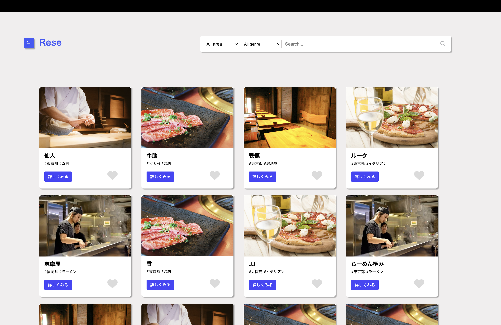
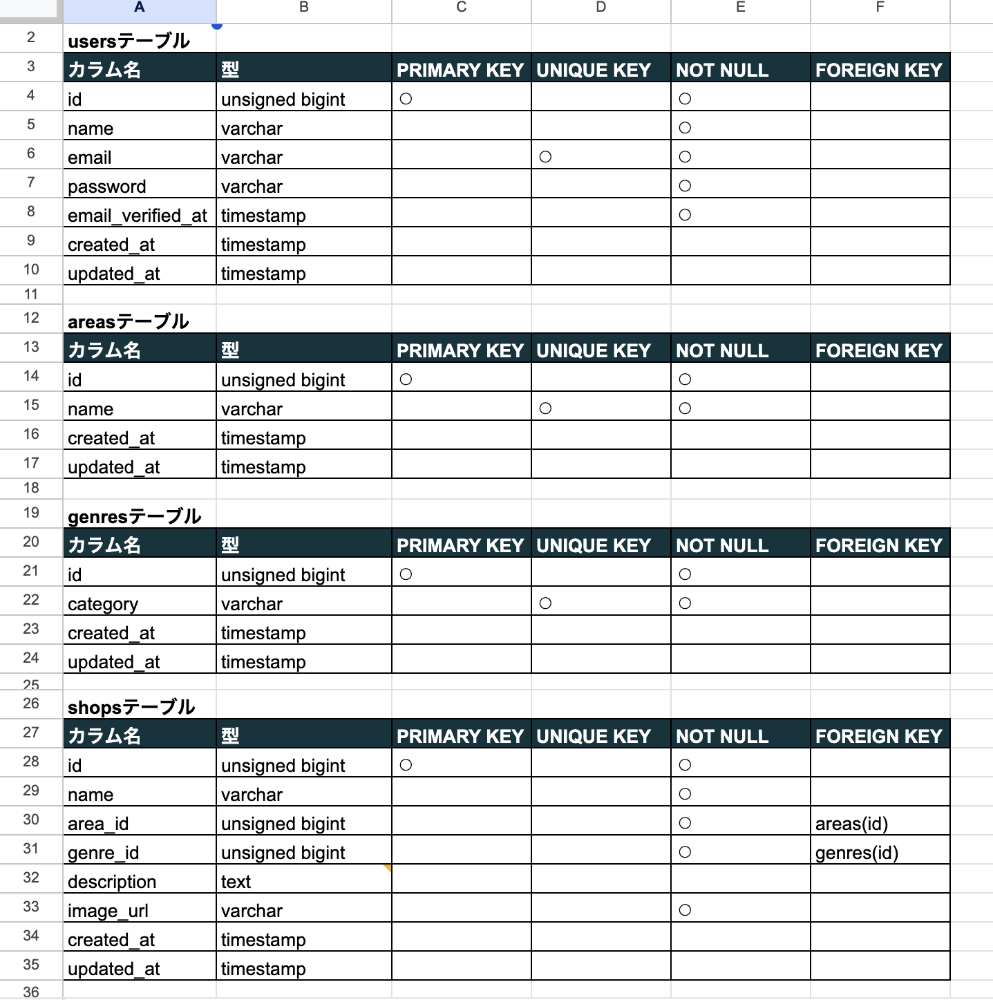
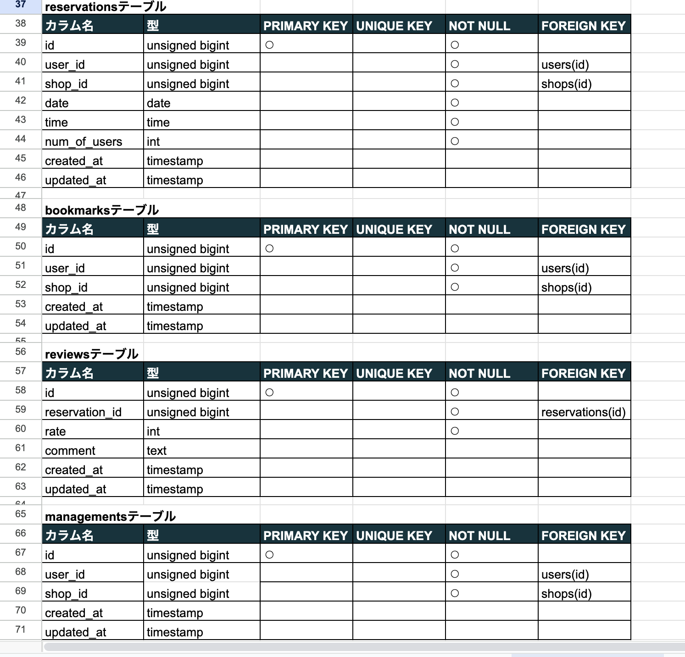
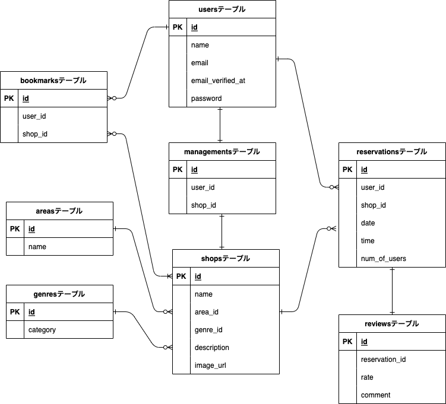

# rese
トップページではお店の一覧が表示される。

ユーザー登録をすることで来店予約ができ、mypageから予約の確認や来店後のレビューを記載することができる。

またお気に入り店舗の登録ができ、mypageから確認することができる。

管理者画面があり、店舗代表者の登録、お知らせメールの送信をすることができる。

店舗代表者は店舗情報の登録・更新、店舗の予約状況の確認、お支払いができる。

また毎朝7時に当日の予約者に確認のメールが届くようになっている。

## 作成した目的
独自のホームページを持つことによって、店舗情報を簡単に登録・更新することができる。

来店予約を受けつけることができ予約状況の確認、お知らせメールや予約当日の朝に確認メールが送れるなど、必要な機能を追加で実装することができる。

## アプリケーションURL
https://github.com/kozaki-ayumi/rese_20231029_kozaki

## 機能一覧
<ユーザー画面>

新規ユーザー登録機能

ログイン機能

予約と予約の変更・削除機能

レビュー機能

お気に入り機能

<管理者画面>

店舗代表者登録機能

お知らせメールの作成と送信機能

<店舗代表者画面>

店舗の予約状況確認機能

店舗情報新規登録機能

店舗情報更新機能

stripeを用いた決済機能

<その他>

予約当日の朝7時にメールを送信するタスクスケジュール機能

## 使用技術
Docker

Laravel 8.83.27

## テーブル設計

## ER図

# 環境構築
phpコンテナ内で下記コマンドを入力してください。

・シーダーファイルにある店舗情報と地域・ジャンルデータの登録。

php artisan db:seed

・シーダーファイルにある管理者登録と管理者・店舗代表者の権限の登録。

php artisan db:seed --class=AdminPermissionSeeder

・予約当日朝7時に予約確認メールの送信。

php artisan schedule:run

## その他
<管理者のログイン情報>

email:[kanrisya@sample.com]

password:password

